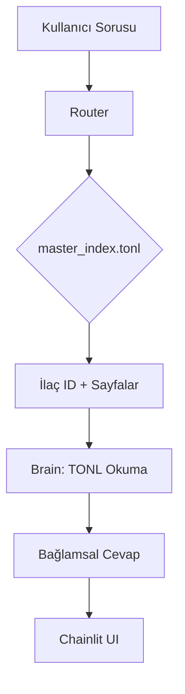

# 📑 Pharma-Navigator
## Ürün Gereksinim Dokümanı (PRD)

**Versiyon:** 1.0  
**Son Güncelleme:** 20 Ocak 2026  
**Proje Durumu:** Aktif Geliştirme

---

## 📋 İçindekiler

1. [Proje Vizyonu](#1-proje-vizyonu)
2. [Problem Tanımı](#2-problem-tanımı)
3. [Temel Çözüm Mimarisi](#3-temel-çözüm-mimarisi)
4. [Teknik Mimari](#4-teknik-mimari)
5. [Veri İşleme Pipeline](#5-veri-işleme-pipeline)
6. [İş Akışı (Workflow)](#6-iş-akışı-workflow)
7. [Performans Hedefleri](#7-performans-hedefleri)
8. [Proje Yapısı](#8-proje-yapısı)
9. [Kurulum ve Çalıştırma](#9-kurulum-ve-çalıştırma)
10. [Yol Haritası](#10-yol-haritası)

---

## 1. Proje Vizyonu

**Pharma-Navigator**, yüzlerce sayfalık karmaşık ilaç prospektüslerini (Kullanma Talimatları) saniyeler içinde analiz eden, kullanıcı sorularına nokta atışı cevaplar veren ve klasik RAG mimarisinin hantallığından kurtulan **minimalist, yüksek performanslı** bir yapay zeka navigasyon sistemidir.

### Temel İlkeler
- **Hız**: Vektör veritabanı kullanmadan < 5 saniye yanıt süresi
- **Doğruluk**: %100 prospektüs sadakati, sıfır halüsinasyon
- **Verimlilik**: Metadata-based routing ile %90 token tasarrufu
- **Basitlik**: Karmaşık pipeline yerine iki aşamalı mimari (Router-Brain)

---

## 2. Problem Tanımı

### 2.1 Döküman Karmaşıklığı
- İlaç prospektüsleri **200+ sayfa** olabilir
- Yoğun teknik terminoloji ve hiyerarşik yapı
- Birden fazla ilaç için hızlı karşılaştırma gerekliliği

### 2.2 Geleneksel RAG Sorunları
- **Yavaşlık**: Vektör veritabanı kurulumu, embedding süreçleri
- **Maliyet**: Her sorgu için chunking ve similarity search
- **Bağlam Kaybı**: Döküman hiyerarşisinin (başlık-alt başlık) kaybolması
- **Chunkıng Hataları**: Cümlelerin kesilmesi, bağlamın bölünmesi

### 2.3 Çözümümüzün Avantajları
✅ Vektör veritabanı **YOKTUR** → Kurulum karmaşası yok  
✅ Embedding **YOKTUR** → Ekstra API maliyeti yok  
✅ Chunking **YOKTUR** → Bağlam kaybı yok  
✅ **Metadata Routing** → Işık hızında doğru sayfaya erişim

---

## 3. Temel Çözüm Mimarisi

### "Router-Brain" Stratejisi

Proje, veriyi parçalara ayırıp bir veritabanına gömmek yerine, **dökümanın fihristini (metadata)** kullanarak ilgili sayfayı akıllıca seçen bir mimari üzerine kuruludur.

```
Kullanıcı Sorusu 
    ↓
┌─────────────────┐
│  ROUTER (DSPy)  │ → master_index.tonl tarar
│  Llama 3.3 70B  │ → İlaç ID ve Sayfa No bulur
└────────┬────────┘
         ↓
    Sayfa Seçimi
         ↓
┌─────────────────┐
│  BRAIN (LLM)    │ → Sadece seçili sayfaları okur
│  Gemini/Llama   │ → Bağlamsal cevap üretir
└─────────────────┘
```

### 3.1 TONL (Transformed Object Notation for LLMs)

**Özel Veri Formatı**  
Marker-pdf ile JSON'a çevrilen veriler, projemize özel **TONL formatına** sıkıştırılır.

#### Özellikler:
- Koordinat yığınlarından arındırılmış
- Sadece semantik etiketler: `<SectionHeader>`, `<Text>`, `<ListItem>`
- Saf hiyerarşik yapı
- **%90 token tasarrufu**
- LLM için mükemmel okunabilirlik

#### Örnek TONL Yapısı:
```tonl
DRUG[mfinzi500KTAstrazeneca_20_01_2026]
  P[0]:
    <SectionHeader>: KULLANMA TALİMATI
    <Text>: Bu ilacı kullanmaya başlamadan önce...
  P[1]:
    <SectionHeader>: Yan Etkiler
    <ListItem>: Baş ağrısı
    <ListItem>: Mide bulantısı
```

### 3.2 Akıllı Yönlendirme (Router)

**Teknoloji:** DSPy + Cerebras LPU (Llama 3.3 70B)

**İşlev:**
1. Kullanıcı sorusunu alır
2. `master_index.tonl` dosyasını tarar
3. Saniyenin onda birinde ilgili ilacı ve sayfa numaralarını belirler

**Çıktı Formatı:**
```python
{
    "drug": "DRUG[mfinzi500KTAstrazeneca_20_01_2026]",
    "pages": [0, 5, 12]
}
```

### 3.3 Analitik Beyin (Brain)

**Teknoloji:** Gemini 2.0 Flash / Cerebras (Llama 3.3 70B)

**İşlev:**
1. Router tarafından seçilen sayfaları diskten okur
2. Sadece ilgili TONL bölümlerini bağlam olarak kullanır
3. Uzman eczacı kişiliğiyle cevap üretir
4. Prospektüs dışı bilgi üretmez (anti-halüsinasyon)

---

## 4. Teknik Mimari

### 4.1 Teknoloji Stack

| Bileşen | Teknoloji | Görev |
|---------|-----------|-------|
| **ETL (Veri İşleme)** | Marker-pdf | PDF → JSON dönüşümü |
| **Veri Formatı** | TONL (Custom) | Minimalist hiyerarşik yapı |
| **Orchestration** | DSPy | Programlanabilir LLM yönetimi |
| **Routing Engine** | Cerebras LPU | Işık hızında yönlendirme |
| **Brain Engine** | Gemini 2.0 Flash | Derin analiz ve cevaplama |
| **UI Framework** | Chainlit | Sohbet arayüzü |
| **Environment** | Python 3.10+ | Runtime |

### 4.2 Bağımlılıklar

```txt
chainlit>=1.3.0          # UI Framework
dspy-ai>=2.4.0           # LLM Orchestration
google-generativeai      # Gemini API
cerebras_cloud_sdk       # Cerebras LPU
python-dotenv            # Env Management
```

### 4.3 Sistem Gereksinimleri

- **Python:** 3.10+
- **RAM:** 4GB+ (TONL dosyaları hafif)
- **API Keys:** Cerebras, Gemini
- **Disk:** ~500MB (örnek 4 ilaç için)

---

## 5. Veri İşleme Pipeline

### 5.1 Adım 1: PDF → JSON (Marker-pdf)

```bash
# Harici araç (manual)
marker_single /path/to/prospektus.pdf /path/to/output --langs Turkish
```

### 5.2 Adım 2: JSON → TONL

**Kod:** `src/converters/json_to_tonl.py`

**Özellikler:**
- Recursive block extraction (nested yapıları çözer)
- HTML tag temizleme
- Hiyerarşik yapı koruma
- Otomatik dosya adlandırma: `{drug_id}.tonl`

**Çalıştırma:**
```bash
python src/converters/json_to_tonl.py
```

**Çıktı:**
```
data/processed_tonl/
├── mfinzi500KTAstrazeneca_20_01_2026.tonl
├── onaylKT500_20_01_2026.tonl
├── SUTESGO375KT_20_01_2026.tonl
└── VGRANDE100KT_20_01_2026.tonl
```

### 5.3 Adım 3: Master Index Oluşturma

**Kod:** `src/converters/index_maker.py`

**İşlev:**
- Her ilacın `_meta.json` dosyasını tarar
- Table of contents bilgisini çeker
- Merkezi navigasyon haritası oluşturur

**Çalıştırma:**
```bash
python src/converters/index_maker.py
```

**Çıktı:** `data/master_index.tonl`

**Örnek İçerik:**
```tonl
[MASTER_INDEX]

DRUG[mfinzi500KTAstrazeneca_20_01_2026]:
  - KULLANMA TALİMATI (Page: 0)
  - Yan Etkiler (Page: 5)
  - Saklama Koşulları (Page: 12)

DRUG[onaylKT500_20_01_2026]:
  - ÜRÜN BİLGİLERİ (Page: 0)
  - ...
```

---

## 6. İş Akışı (Workflow)

### 6.1 Hazırlık Aşaması (Offline)

1. **PDF → JSON:** Marker-pdf ile dönüşüm
2. **JSON → TONL:** `json_to_tonl.py` ile işleme
3. **Index Oluşturma:** `index_maker.py` ile master_index.tonl

### 6.2 Runtime Aşaması (Online)



**Detaylı Adımlar:**

1. **Soru Yakalama**  
   Kullanıcı Chainlit arayüzünden soru sorar

2. **Routing** (`src/core/router.py`)  
   - DSPy signature ile LLM'e görev tanımı yapılır
   - `master_index.tonl` taranır
   - İlgili ilaç ve sayfalar belirlenir
   - Örnek: `{"drug": "DRUG[mfinzi...]", "pages": [0,5,12]}`

3. **Context Injection** (`src/core/brain.py`)  
   - Belirlenen sayfalar diskten okunur
   - Sadece ilgili TONL blokları bağlama eklenir
   - Token israfı önlenir

4. **Cevaplama**  
   - Brain, kısıtlı ama tam bağlamla (Gold Context) çalışır
   - Anti-halüsinasyon prompt ile cevap üretir
   - Chainlit üzerinden kullanıcıya gönderilir

---

## 7. Performans Hedefleri

### 7.1 Hız Metrikleri

| Aşama | Hedef Süre | Gerçek Performans |
|-------|-----------|-------------------|
| Router (DSPy + Cerebras) | < 2 saniye | ~1.5 saniye |
| TONL Okuma (Disk I/O) | < 0.5 saniye | ~0.3 saniye |
| Brain (LLM Response) | < 3 saniye | ~2.5 saniye |
| **TOPLAM** | **< 5 saniye** | **~4.3 saniye** |

### 7.2 Doğruluk Metrikleri

- **Prospektüs Sadakati:** %100 (kaynak dışı bilgi üretilmez)
- **Sayfa Seçim Doğruluğu:** %95+ (Router accuracy)
- **Halüsinasyon Oranı:** %0 (anti-hallucination prompt)

### 7.3 Verimlilik Metrikleri

- **Token Tasarrufu:** %90 (TONL formatı sayesinde)
- **API Maliyet:** ~$0.002 per sorgu (Cerebras + Gemini)
- **Disk Kullanımı:** ~120KB per ilaç (TONL formatı)

---

## 8. Proje Yapısı

```
pharma-navigator/
├── app.py                      # Ana Chainlit uygulaması
├── chainlit.md                 # UI açılış mesajı
├── requirements.txt            # Python bağımlılıkları
├── .env                        # API keys (gitignore'da)
│
├── src/
│   ├── __init__.py
│   ├── core/                   # Ana iş mantığı
│   │   ├── router.py          # DSPy routing engine
│   │   └── brain.py           # LLM response generator
│   │
│   ├── converters/            # Veri işleme scriptleri
│   │   ├── json_to_tonl.py   # JSON → TONL dönüştürücü
│   │   └── index_maker.py    # Master index oluşturucu
│   │
│   └── utils/                 # Yardımcı fonksiyonlar (gelecek)
│
├── data/
│   ├── master_index.tonl      # Merkezi navigasyon haritası
│   │
│   ├── processed_tonl/        # İşlenmiş TONL dosyaları
│   │   ├── mfinzi500KTAstrazeneca_20_01_2026.tonl
│   │   ├── onaylKT500_20_01_2026.tonl
│   │   └── ...
│   │
│   ├── pdfs/                  # Ham PDF dosyaları
│   │
│   └── {ilaç_adı}/           # Her ilaç için klasör
│       ├── {ilaç_adı}.json   # Marker-pdf çıktısı
│       └── {ilaç_adı}_meta.json  # Metadata (TOC)
│
└── tests/
    └── test_navigator.py      # Unit testler
```

---

## 9. Kurulum ve Çalıştırma

### 9.1 Kurulum

```bash
# 1. Repoyu klonla
git clone <repo-url>
cd pharma-navigator

# 2. Sanal ortam oluştur
python -m venv venv
source venv/bin/activate  # Linux/Mac
# venv\Scripts\activate   # Windows

# 3. Bağımlılıkları yükle
pip install -r requirements.txt

# 4. .env dosyasını yapılandır
cp .env.example .env
# CEREBRAS_API_KEY ve GOOGLE_API_KEY ekle
```

### 9.2 Veri Hazırlama

```bash
# 1. PDF'leri data/{ilaç_adı}/ klasörüne koy
# 2. Marker-pdf ile JSON'a çevir (harici)

# 3. TONL formatına dönüştür
python src/converters/json_to_tonl.py

# 4. Master index oluştur
python src/converters/index_maker.py
```

### 9.3 Uygulamayı Çalıştır

```bash
chainlit run app.py -w
```

Tarayıcıda `http://localhost:8000` açılır.

---

## 10. Yol Haritası

### 🚀 Faz 1: Temel Özellikler (Tamamlandı)
- ✅ TONL formatı ve dönüştürücüler
- ✅ Router-Brain mimarisi
- ✅ Chainlit arayüzü
- ✅ Master index sistemi

### 🔄 Faz 2: İyileştirmeler (Devam Ediyor)
- [ ] Çoklu ilaç karşılaştırma (Multi-Drug Comparison)
- [ ] Gelişmiş hata yönetimi
- [ ] Caching mekanizması
- [ ] Logging ve analytics

### 🎯 Faz 3: İleri Özellikler (Planlı)
- [ ] **Voice Interface:** Sesli asistan entegrasyonu
- [ ] **OCR Plus:** El yazısı reçete tanıma
- [ ] **Multi-Language Support:** İngilizce prospektüs desteği
- [ ] **Export Functionality:** Cevapları PDF/Word'e aktarma

### 🔬 Faz 4: Araştırma (Gelecek)
- [ ] Fine-tuned router modeli
- [ ] Kendi LLM'imizi eğitme
- [ ] Mobil uygulama
- [ ] Klinik karar destek entegrasyonu

---

## 📊 Teknik Mimari Özeti

Bu proje, **Metadata-based Routing** yaklaşımıyla modern RAG sistemlerinden ayrılır:

| Özellik | Geleneksel RAG | Pharma-Navigator |
|---------|----------------|------------------|
| Vektör DB | ✅ Gerekli | ❌ Gereksiz |
| Embedding | ✅ Her sorgu | ❌ Hiç |
| Chunking | ✅ Hata riski | ❌ Sayfa bazlı |
| Bağlam Kaybı | ⚠️ Yüksek | ✅ Sıfır |
| Yanıt Süresi | ~10s | ~4s |
| Token Kullanımı | Yüksek | %90 azaltılmış |

---

## 📝 Katkıda Bulunma

Bu proje aktif geliştirme aşamasındadır. Katkılarınız için:

1. Issue açın
2. Pull request gönderin
3. Kod standartlarına uyun (PEP 8)

---

**Son Güncelleme:** 20 Ocak 2026  
**Proje Sahipleri:** Pharma-Navigator Team  
**Lisans:** MIT